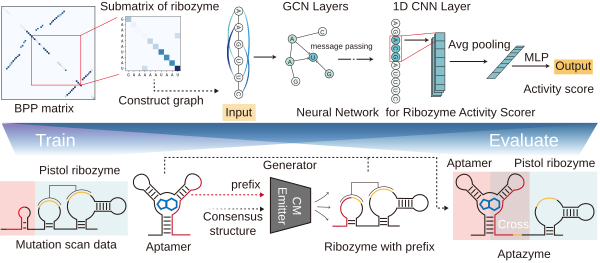

A graph-neural-network model that predicts the self-cleavage activity of
ribozyme-based gene-control elements (aptamer–ribozyme switches) from sequence
and predicted secondary structure, and uses that predictor to prioritize novel
candidate sequences generated from the ribozyme family covariance model.



### Repository layout

```
scorer/        
scripts/       
  train_scorer.py      
  generator.py         
  score_design.py      
  evaluate_scorer.py   
  ablate_scorer.py     
model/         
utils/        
data/         
```

### Quick start

From the repository root:

```bash
# 1. Train the GNN predictor (full run; use --subset 4000 for a fast local check)
python scripts/train_scorer.py --subset 0 --epochs 60

# 2. Generate novel candidate cores conditioned on aptamer junctions
python scripts/generator.py --max-aptamers 100 --n 200

# 3. Score candidates and emit a design batch
python scripts/score_design.py --model out/fcminus_gcn.pt --in out/generated_design_input.csv
```


